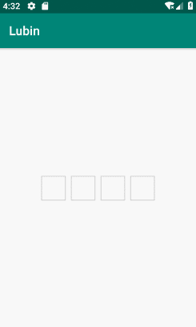
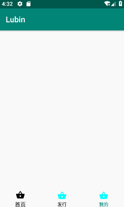
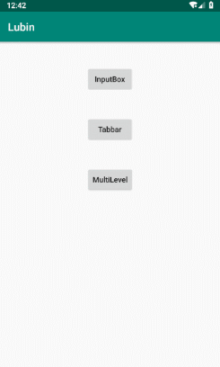

# LubinWidget

    几个Android开发小控件，便于快速开发，后续更新中(整合于其它控件库)。
    
    
* InputBoxLayout

 [](https://github.com/JC0127/InputBoxLayout/blob/master/README.md)

* LubinBottomTabBar

 [](https://github.com/JC0127/BottomTabBar/blob/master/README.md)


 
* MultiLevelBottomDialog(0.6.0版新增加)
  



* [](https://jitpack.io/#JC0127/LubinWidget)
 


### 使用 
```markdown
	allprojects {
		repositories {
			...
			maven { url 'https://jitpack.io' }
		}
	}
	
	dependencies {
    	        implementation 'com.github.robin-lk:LubinWidget:0.6.2'
    	}
```
### 或 

* [  ](https://bintray.com/lubin/MavenLubin/LubinWidget/_latestVersion)

```markdown
    //如果使用的是support
    compile 'com.github.robin-lk:LubinWidget:0.6.0'
    
    //如果你适配了androidx
    compile 'com.github.robin-lk:LubinWidget:0.6.1'
```

#### InputBoxLayout

xml 使用路径有所更改
```xml
    <com.lubin.widget.inputbox.InputBoxLayout
        android:id="@+id/box"
        android:layout_width="wrap_content"
        android:layout_height="wrap_content"
        android:layout_centerInParent="true"
        app:box_account="4"
        app:box_height="40dp"
        app:box_margin="4dp"
        app:box_width="40dp" />
```

#### LubinBottomTabBar

xml 使用路径有所更改
```xml
    <com.lubin.widget.tabbar.LubinBottomTabBar
        android:id="@+id/tab_bar"
        android:layout_width="match_parent"
        android:layout_height="45dp"
        android:layout_alignParentBottom="true" />
```
#### MultiLevelBottomDialog

MultiLevelBottomDialog一个类型京东app地址选择的框架，城市数据自己提供。
```java
 //初始化
 multiLevelBottomDialog = MultiLevelBottomDialog.newInstance().initDialogHeight("int 高度");
 //加载数据
 multiLevelBottomDialog.loadData(beans, MultiLevelBottomDialog.TYPE_PROVINCE);
 //设置监听回调
 multiLevelBottomDialog.setListener();
 
     /**
      * 选中的项
      *
      * @param cityName     选中的name
      * @param cityCode     选中的code
      * @param nextCityType 所需的下一个级别
      */
     void onSelectedCallBack(String cityName, String cityCode, int nextCityType);
 
     /**
      * 全部选中返回
      *
      * @param provinceName      省
      * @param cityName          市
      * @param countyName        县/区
      * @param subdistrictOffice 街道
      * @param cityCode          选中的code
      */
     void onFullSelectedCallBack(String provinceName, String cityName, String countyName, String subdistrictOffice, String cityCode);
```

### 详细使用请参考
* [InputBoxLayout](https://github.com/JC0127/InputBoxLayout/blob/master/README.md)
* [LubinBottomTabBar](https://github.com/JC0127/BottomTabBar/blob/master/README.md)
 
